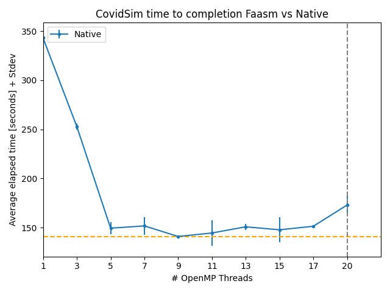

# Covid Simulator Plots

We plot the execution time of the CovidSim simulator as we increase the number
of OpenMP threads in a single host (native) and across multiple hosts (faasm).

## Set-up

TBD
