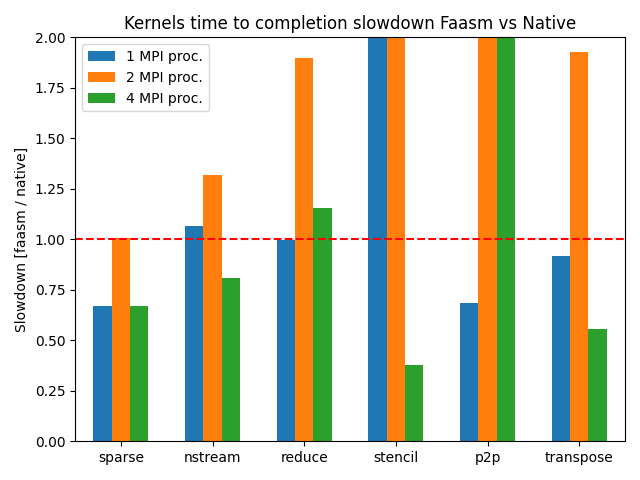

# ParRes Kernels Plots

We plot the slowdown of faasm's MPI implementation compared to the native MPI
execution.

## Set-up

We run both experiments in the AKS cluster.
The native one with our MPI-on-k8s setting, the Faasm one through Knative.
